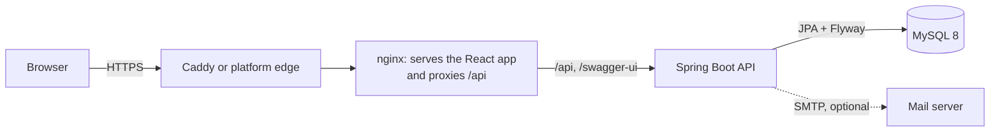
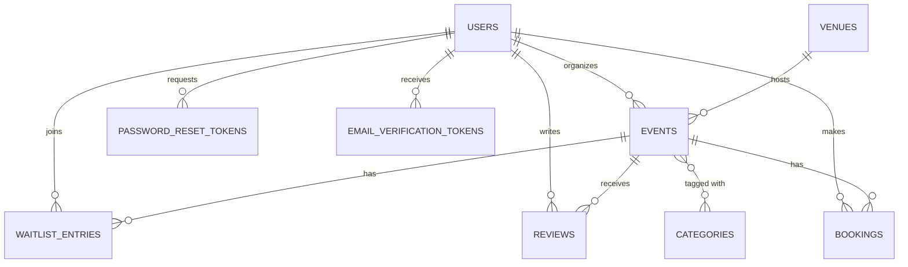
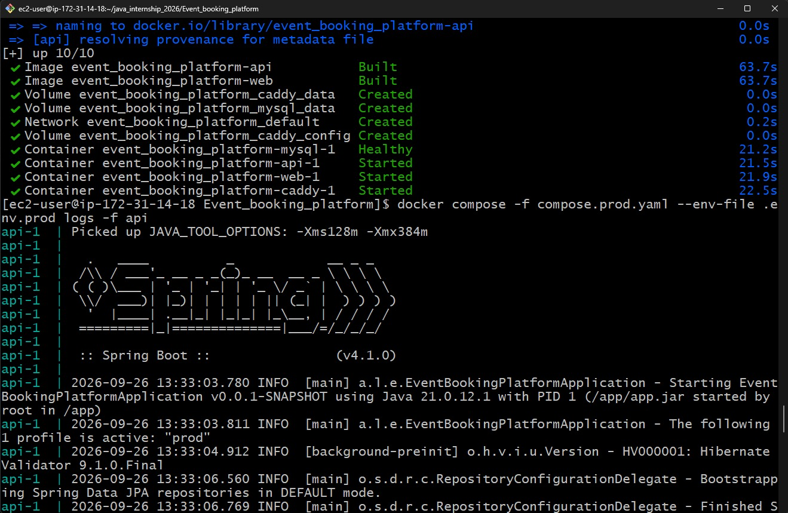
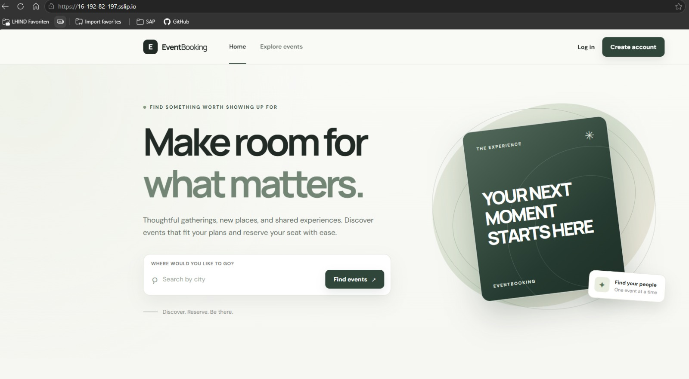

# Event Booking Platform

A full-stack event booking system. **Organizers** publish events that take place at **venues**, **attendees**
browse and reserve seats, and **admins** manage the catalog, the users, and every booking.

- **Backend:** Java 21, Spring Boot 4, Spring Security (JWT), Spring Data JPA, MySQL 8, Flyway, Swagger/OpenAPI, Log4j2
- **Frontend:** React 19, TypeScript, Vite, React Router
- **Delivery:** Docker, Docker Compose, GitHub Actions CI, deployed on Railway and on AWS EC2

This README explains the project from the basics: what it does, how it is built, how to run it, how to test it, what
data is in the demo deployments, how to try every feature, and how it was deployed on AWS EC2.

> The two live deployments are temporary demos for the internship review:
> Railway `https://web-event-management.up.railway.app` and AWS EC2 `https://16-192-82-197.sslip.io`.

## Table of contents

1. [What the system does](#1-what-the-system-does)
2. [Architecture](#2-architecture)
3. [Repository layout](#3-repository-layout)
4. [Data model](#4-data-model)
5. [Business rules](#5-business-rules)
6. [Security](#6-security)
7. [API overview](#7-api-overview)
8. [Database access layer](#8-database-access-layer)
9. [Database migrations (Flyway)](#9-database-migrations-flyway)
10. [Configuration and profiles](#10-configuration-and-profiles)
11. [Running locally](#11-running-locally)
12. [The frontend](#12-the-frontend)
13. [Testing](#13-testing)
14. [Logging and API documentation](#14-logging-and-api-documentation)
15. [Demo data (what is in Railway and EC2)](#15-demo-data-what-is-in-railway-and-ec2)
16. [Feature walkthrough (step by step)](#16-feature-walkthrough-step-by-step)
17. [Deployment on Railway](#17-deployment-on-railway)
18. [Deployment on AWS EC2](#18-deployment-on-aws-ec2)
19. [Continuous integration](#19-continuous-integration)
20. [Troubleshooting](#20-troubleshooting)
21. [Known limitations and ideas](#21-known-limitations-and-ideas)

---

## 1. What the system does

There are three roles, plus visitors who are not signed in.

| Role | What they can do |
|---|---|
| **Visitor** (not signed in) | Register, log in, reset a forgotten password, browse and search published events, open an event's details |
| **ATTENDEE** | Everything a visitor can, plus: book seats, view and cancel their own bookings, join or leave a waitlist for a sold-out event, review an event they attended |
| **ORGANIZER** | Create, update, publish and cancel their own events, and see the bookings made against them. Cannot touch another organizer's events |
| **ADMIN** | Manage venues, categories and users (including activating/deactivating accounts), see all events, and view and cancel any booking |

Public registration always creates an ATTENDEE. Organizer and admin accounts are created by an admin (the very first
admin is created from configuration, see [Demo data](#15-demo-data-what-is-in-railway-and-ec2) and
[Configuration](#10-configuration-and-profiles)).

## 2. Architecture



- The **React app** is compiled to static files and served by **nginx**. nginx also forwards `/api/...`,
  `/swagger-ui` and `/api-docs` to the Spring Boot API, so the browser only ever talks to one address. That means the
  browser sees a single origin and CORS is not needed for normal use.
- The **API** is stateless: every request carries a signed JWT, and no server-side session is stored.
- **MySQL** holds all data. The schema is created and evolved by **Flyway** migrations.
- On EC2, **Caddy** sits in front and obtains a free HTTPS certificate automatically. On Railway, the platform provides HTTPS.

Request flow for a booking: the browser calls `POST /api/v1/bookings/events/{id}` with the JWT, the security filter
checks the token and role, the controller validates the request, the service locks the event row, checks the seats,
saves the booking and updates the seat count in one transaction, and the response goes back as JSON.

## 3. Repository layout

```
Event_booking_platform/
├── backend/                     Spring Boot API (single Maven module)
│   ├── pom.xml
│   ├── Dockerfile
│   ├── scripts/seed-dev.sql     Local development seed data (dev only)
│   └── src/
│       ├── main/java/al/lhind/eventbooking/
│       │   ├── config/          OpenAPI, bootstrap admin, demo data
│       │   ├── controller/      REST controllers, one per resource and role
│       │   ├── dto/             request/response records
│       │   ├── entity/          JPA entities and enums
│       │   ├── exception/       domain exceptions + global error handler
│       │   ├── repository/      Spring Data repositories
│       │   ├── security/        JWT filter/service, security configuration
│       │   └── service/         business logic (interfaces + impl/)
│       ├── main/resources/
│       │   ├── application*.properties   base + dev / int / prod profiles
│       │   ├── log4j2-spring.xml
│       │   └── db/migration/    Flyway SQL migrations (V1, V2, ...)
│       └── test/                unit and integration tests
├── frontend/                    React + TypeScript app
│   ├── Dockerfile, nginx/       production image (nginx)
│   └── src/                     pages, components, features, services
├── deploy/                      production helpers for EC2
│   ├── Caddyfile                HTTPS reverse proxy config
│   ├── ec2-setup.sh             one-time server setup (Docker, swap)
│   └── images/                  screenshots of the EC2 deployment
├── compose.yaml                 local development stack
├── compose.prod.yaml            production stack (EC2)
├── .env.example                 template for local variables
└── .env.prod.example            template for production variables
```

The CI workflow is not inside this folder: it is `.github/workflows/event-booking-ci.yml` at the **root of the git
repository** (one level above `Event_booking_platform/`), because GitHub only reads workflows from the repository root.
See [section 19](#19-continuous-integration).

Design choices: a **single Maven module** (the assignment allows it, and the project is small enough); code is layered
**controller → service → repository**, with DTO records so entities are never exposed; and services are split into an
interface and an implementation so they can be tested and mocked.

## 4. Data model



| Entity | Main fields | Relationships (and why) |
|---|---|---|
| **User** | id, username, email, password (BCrypt hash), role, active, emailVerified | One user organizes many events and makes many bookings |
| **Venue** | id, name, address, city, capacity | One venue hosts many events; each event has exactly one venue (many-to-one) |
| **Category** | id, name (unique) | Many-to-many with events through `event_categories` |
| **Event** | id, title, description, startDateTime, endDateTime, price, totalSeats, availableSeats, status (DRAFT, PUBLISHED, CANCELLED), imageUrl, version | Belongs to one organizer and one venue; has many bookings and categories |
| **Booking** | id, seatsBooked, status (CONFIRMED, CANCELLED), bookingDate | Belongs to exactly one user and one event |
| **Review** | id, rating (1-5), comment, createdAt | One user, one event; unique per (user, event) |
| **WaitlistEntry** *(extra)* | id, status (WAITING, PROMOTED, CANCELLED), joinedAt | One user, one event; unique per (user, event) |
| **PasswordResetToken** *(extra)* | tokenHash, expiresAt, usedAt | One user; only the SHA-256 hash of the token is stored |
| **EmailVerificationToken** *(extra)* | tokenHash, expiresAt, usedAt | One user; same hashing |

The relationship types were derived from the business rules in the assignment. The `Event.version` column enables
optimistic locking, which is one of two protections against overbooking (see the next section).

## 5. Business rules

- **Seats are never oversold.** Booking and cancelling lock the event row (`SELECT ... FOR UPDATE`, a pessimistic
  lock) inside a transaction, and events also carry a `@Version` for optimistic locking. Twenty simultaneous
  bookings for five seats result in exactly five confirmed bookings and zero seats left (verified by testing).
- **Only PUBLISHED events can be booked or shown publicly.** Drafts and cancelled events return 404 to visitors.
- **Cancellation policy:** a confirmed booking can be cancelled by its owner **at least 24 hours before the event
  starts**. Inside that window the API answers 409 with an explanation.
- **Waitlist:** an attendee can join the waitlist only when the event is fully booked. When a confirmed booking is
  cancelled and seats free up, the oldest waiting attendee is **automatically promoted** to a confirmed booking.
  Attendees can list their waitlist and leave it.
- **Reviews:** allowed only if the user has a **confirmed booking** for that event **and the event has already ended**,
  at most **one review per user per event**. Ratings are 1 to 5. The event detail shows the **average rating**.
- **Events:** the start must be in the future and the end after the start; total seats cannot exceed the venue
  capacity; a published event that already has confirmed bookings cannot be edited; a started event cannot be
  edited or cancelled; cancelling an event cancels all its bookings and waitlist entries.
- **Ownership:** an organizer touching another organizer's event gets 404 (the event is invisible to them).
- **Catalog integrity:** a venue that has events, or a category used by events, cannot be removed (409).
- **Accounts:** usernames and emails are unique; a deactivated user cannot log in; an admin cannot deactivate
  themselves or remove their own admin role.
- **Passwords:** 8-72 characters with an uppercase letter, a lowercase letter, a number and a special character
  (enforced by the API and shown as a live checklist in the UI).

## 6. Security

- **Authentication:** `POST /api/v1/auth/login` returns a **JWT** (`Authorization: Bearer <token>`). The token lifetime
  is `JWT_EXPIRATION` milliseconds (default one hour). Passwords are stored as **BCrypt** hashes.
- **Authorization:** URL rules in `SecurityConfig` restrict `/api/v1/admin/**` to ADMIN, `/api/v1/organizer/**` to
  ORGANIZER, and bookings/waitlist to ATTENDEE; services re-check ownership and role as a second line of defence.
- **Errors:** 401 (missing/invalid token) and 403 (wrong role) are returned as JSON. Validation errors return 400 with
  a `validationErrors` map per field.
- **CORS:** only origins listed in `CORS_ALLOWED_ORIGINS` may call the API from a browser. When the frontend is served
  through nginx (same origin) this list is not needed.
- **Email verification** (optional): new accounts must confirm their email before signing in when
  `EMAIL_VERIFICATION_REQUIRED=true`. Accounts created by an admin, and seeded accounts, are already verified.
- **Password reset:** "Forgot your password?" emails a link containing a random token (valid 30 minutes, single use,
  stored only as a hash). The API answers the same way whether or not the email exists, so it cannot be used to find
  accounts, and repeated requests within a minute are throttled.
- **Secrets** come from environment variables and are never committed (`.env` files are git-ignored).

## 7. API overview

Base path: `/api/v1`. The complete, interactive documentation is available in Swagger UI (see
[section 14](#14-logging-and-api-documentation)). All errors use one JSON shape:
`{ timestamp, status, error, message, path, validationErrors }`.

**Public**

| Method | Path | Purpose |
|---|---|---|
| POST | `/auth/register` | Create an ATTENDEE account |
| POST | `/auth/login` | Log in, returns `{accessToken, tokenType, role}` |
| POST | `/auth/forgot-password` | Request a reset email (always answers 202) |
| POST | `/auth/reset-password` | Set a new password using the emailed token |
| POST | `/auth/verify-email` | Confirm an email address |
| POST | `/auth/resend-verification` | Send the verification email again |
| GET | `/events` | Search published events: `city`, `categoryId`, `startsAfter`, `startsBefore`, `minimumPrice`, `maximumPrice`, `page`, `size`, `sort` |
| GET | `/events/{id}` | Event details incl. venue, organizer, categories, average rating |
| GET | `/categories` | List categories (for filters and forms) |

**Any signed-in user:** `POST /account/password` (change own password).

**Attendee**

| Method | Path | Purpose |
|---|---|---|
| POST | `/bookings/events/{eventId}` | Book seats `{seatsBooked}` |
| GET | `/bookings?status=` | My bookings, optionally by status |
| DELETE | `/bookings/{id}` | Cancel my booking (24-hour rule) |
| POST | `/events/{eventId}/waitlist` | Join the waitlist of a full event |
| GET | `/waitlist` | My waitlist entries |
| DELETE | `/waitlist/{id}` | Leave a waitlist |
| POST | `/events/{eventId}/reviews` | Review an attended event `{rating, comment}` |

**Organizer**

| Method | Path | Purpose |
|---|---|---|
| GET / POST | `/organizer/events` | List my events (incl. drafts) / create a draft |
| GET / PUT | `/organizer/events/{id}` | Read / update my event |
| PATCH | `/organizer/events/{id}/publish` | Publish |
| PATCH | `/organizer/events/{id}/cancel` | Cancel |
| GET | `/organizer/bookings` | Bookings on my events |
| GET | `/organizer/venues` | Venues to choose from |

**Admin**

| Method | Path | Purpose |
|---|---|---|
| GET/POST/PUT/DELETE | `/admin/venues[/{id}]` | Manage venues |
| GET/POST/PUT/DELETE | `/admin/categories[/{id}]` | Manage categories |
| GET/POST | `/admin/users` | List (paged) / create any role |
| GET/PUT | `/admin/users/{id}` | Read / update username, email, role |
| PATCH | `/admin/users/{id}/activation` | `{active: true|false}` |
| GET | `/admin/bookings[/{id}]` | All bookings (paged) |
| PATCH | `/admin/bookings/{id}/cancel` | Cancel any booking |
| GET | `/admin/events[/{id}]` | All events, any status (paged) |

## 8. Database access layer

The assignment asks for every way of querying to be used at least once. All three are used:

- **Derived query methods** — the query comes from the method name, e.g.
  `findByUserIdAndStatus(userId, status)`, `findByEventIdAndStatus(...)`, `existsByNameIgnoreCase(name)`.
- **JPQL** — object queries with `@Query`, e.g. the public event search (a dynamic filter by city, category, date range
  and price range with paging), the organizer's bookings, and the average rating (`select avg(r.rating) ...`).
- **Native SQL** — `select * from events where id = :eventId for update` in `EventRepository`, a native locking read used
  to protect seat counts.

Other techniques: `@EntityGraph` to avoid N+1 queries on admin/organizer lists, `@Lock(PESSIMISTIC_WRITE)` for
bookings, `@Version` on events, and `@Modifying` bulk deletes for expired tokens.

## 9. Database migrations (Flyway)

The schema is owned by **Flyway**, not by Hibernate. SQL files live in
`backend/src/main/resources/db/migration` and run in order at startup:

| File | What it does |
|---|---|
| `V1__baseline_schema.sql` | All original tables |
| `V2__event_image_and_email_verification.sql` | `events.image_url`, `users.email_verified`, `email_verification_tokens` |

- Flyway records what it applied in the `flyway_schema_history` table and refuses to start if an applied file was edited.
- Hibernate runs with `ddl-auto=validate`: it only **checks** that the entities match the schema. The integration tests
  run against a fresh MySQL, so a mismatch fails the build.
- A database created before Flyway is adopted automatically (`baseline-on-migrate`, baseline version 1).
- **To change the schema:** add a new file `V3__describe_change.sql` (never edit an old one) and update the entity.

## 10. Configuration and profiles

Spring **profiles** select a set of properties. `application.properties` holds common settings; the profile files add
the rest.

| Profile | Used for | Notes |
|---|---|---|
| `dev` | Local development (default, used by `compose.yaml`) | SQL logging, DEBUG logs for the app, MySQL from Compose, Mailpit for email |
| `int` | Automated tests | Testcontainers supplies the MySQL connection |
| `prod` | Railway and EC2 | Everything comes from environment variables, X-Forwarded headers honoured, real SMTP if configured |

**Environment variables**

| Variable | Purpose | Default / notes |
|---|---|---|
| `SPRING_PROFILES_ACTIVE` | Profile | `dev` |
| `SPRING_DATASOURCE_URL` / `_USERNAME` / `_PASSWORD` | MySQL connection | required in `prod` |
| `JWT_SECRET` | Base64 signing key, at least 32 bytes | required. Generate: `openssl rand -base64 48` |
| `JWT_EXPIRATION` | Token lifetime in ms | `3600000` (1 hour) |
| `CORS_ALLOWED_ORIGINS` | Browser origins allowed to call the API | `http://localhost:5173` |
| `APP_FRONTEND_BASE_URL` | Base URL used in email links | `http://localhost:5173` |
| `EMAIL_VERIFICATION_REQUIRED` | Require verified email before login | `true` (compose.prod default `false`) |
| `MAIL_HOST` / `MAIL_PORT` / `MAIL_USERNAME` / `MAIL_PASSWORD` / `MAIL_FROM` | SMTP for reset and verification emails | optional |
| `PASSWORD_RESET_EXPIRATION_MINUTES` | Reset link lifetime | `30` |
| `BOOTSTRAP_ADMIN_USERNAME` / `_EMAIL` / `_PASSWORD` | Create the first admin if none exists | optional, all three required |
| `DEMO_DATA_ENABLED` / `DEMO_DATA_PASSWORD` | Create demo content once | `false` |
| `API_HEAP_MB` | JVM heap for the API container (compose.prod) | `384` |
| `SITE_ADDRESS` | Public hostname for Caddy (compose.prod) | `:80` |

Frontend: `VITE_API_BASE_URL` (build time) defaults to `/api/v1`. Set a full URL only if the API is on another host.

**Never commit** `.env` or `.env.prod`. Templates: `.env.example` and `.env.prod.example`.

## 11. Running locally

Requirements: Java 21, Maven 3.9+, Node.js 20.19+, Docker Desktop.

**Option A — everything in Docker (simplest)**

```bash
cp .env.example .env
docker compose up --build
```

| Service | Address |
|---|---|
| Web app (nginx) | http://localhost:3000 |
| API | http://localhost:8080 |
| Swagger UI | http://localhost:8080/swagger-ui.html |
| Mailpit (inbox for reset/verification emails) | http://localhost:8025 |
| Health | http://localhost:8080/actuator/health |

Stop with `docker compose down`; add `-v` only if you want to **delete the database**.

**Option B — frontend with hot reload**

```bash
docker compose up -d mysql mailpit api        # backend stack
cd frontend
npm install
npm run dev                                   # http://localhost:5173 (proxies /api to :8080)
```

**Local test data.** A fresh database has no accounts. Load the development seed once, after the API has started once so
the tables exist:

```bash
docker compose exec -T mysql sh -c 'mysql -uroot -p"$MYSQL_ROOT_PASSWORD" event_booking_db' < backend/scripts/seed-dev.sql
```

It creates `admin`, `organizer_anna`, `organizer_marco`, `alice`, `bob`, `carol` and an inactive `dave_inactive`, all
with the password `Password123!` (development only), plus 5 venues, 8 categories, 10 events and sample bookings,
a waitlist entry and reviews. Alternatively set `BOOTSTRAP_ADMIN_*` and `DEMO_DATA_*` (see section 15).

## 12. The frontend

Built with React 19, TypeScript and Vite. The session (JWT + role) lives in `sessionStorage`, or `localStorage` when
"Remember me" is ticked. Expired or rejected tokens sign the user out automatically.

| Route | Who | What |
|---|---|---|
| `/` | everyone | Home, search by city, upcoming events |
| `/events` | everyone | Browse with filters (city, category, dates, price), sorting, pagination |
| `/events/:id` | everyone | Details; book seats, join waitlist or review depending on state |
| `/login`, `/register` | visitors | Sign in (show password, remember me) / create account (live password checklist) |
| `/forgot-password`, `/reset-password`, `/verify-email` | visitors | Password reset and email verification |
| `/account/password` | signed in | Change password |
| `/my/bookings` | attendee | Bookings with status filter and cancel; my waitlist |
| `/organizer/events`, `/new`, `/:id/edit` | organizer | Own events: publish, cancel, create, edit |
| `/organizer/bookings` | organizer | Bookings on own events, with filters |
| `/admin/venues`, `/admin/categories` | admin | Create, edit, list, remove |
| `/admin/users` | admin | Create, edit, activate/deactivate |
| `/admin/bookings`, `/admin/events` | admin | All records; cancel any booking |
| `/forbidden`, `*` | everyone | Access denied / Not found pages |

After login you land on your role's area (attendee: events, organizer: My events, admin: All events).

## 13. Testing

```bash
cd backend
mvn test                                  # everything; needs Docker (Testcontainers starts MySQL)
mvn -Dtest='BookingServiceUnitTest,ReviewServiceUnitTest' test    # fast unit tests, no Docker

cd ../frontend
npm test                                  # Vitest
```

**Backend: 105 tests, all passing.** They are more than isolated unit tests: integration tests boot the real Spring
context against a real **MySQL 8 container** and exercise the whole chain (HTTP → security → validation → service →
database), for example a booking request updating the seat count, or cancellation promoting the waitlist.

| Area | Tests cover |
|---|---|
| Authentication | Registration, login, password reset, email verification, change password, bootstrap admin |
| Events | Public search with every filter, sorting, paging, event details, organizer create/update/publish/cancel, ownership |
| Bookings | Booking, seat limits, cancellation policy, waitlist, promotion, reviews, organizer view |
| Admin | Venues, categories, users, bookings, events |
| Security and errors | 401/403 handling, error shape, CORS, health endpoint, OpenAPI |
| Demo data | Consistent seat counts, repeat-safe, weak password refused |

**Frontend: 7 tests** for the session handling (normal, remembered, expired) and the password field and rules.

In addition, the whole API was exercised end to end with a 121-check script (every role, every rule, plus 20
concurrent bookings) and the UI was walked through in a browser.

## 14. Logging and API documentation

- **Logging:** Log4j2 (`log4j2-spring.xml`), console output with timestamp, level, thread and logger. Business events
  (booking created or cancelled, waitlist changes, logins, password changes) are logged at INFO with ids only, never
  with passwords or tokens. `dev` also logs DEBUG and SQL.
- **Swagger UI:** `/swagger-ui.html` — try endpoints in the browser. For protected endpoints, log in, copy the
  `accessToken`, click **Authorize** and paste it (without `Bearer `).
- **OpenAPI JSON:** `/api-docs`.
- **Health:** `/actuator/health` (public; other actuator endpoints are not exposed).

## 15. Demo data (what is in Railway and EC2)

Both deployments were seeded with the same demo content by the API itself on startup (`DemoDataRunner`), controlled by
`DEMO_DATA_ENABLED=true`. It runs only once: if the demo accounts already exist, it does nothing. All dates are relative
to the moment of seeding.

**Accounts** — all demo accounts of a deployment share **one password**, and the **admin** has its own. These are demo
credentials for a non-production showcase, so they are listed here on purpose.

| Deployment | Admin (`admin`) | All demo accounts (`demo_*`) |
|---|---|---|
| Railway `https://web-event-management.up.railway.app` | `MyDemo%Admin2026` | `Demo%Showcase2026` |
| AWS EC2 `https://16-192-82-197.sslip.io` | `Aa1!Ed2ifi0hXiaME9Il` | `Aa1!srQ3mqpsJtFgfYFQ` |
| Local Docker (after loading `backend/scripts/seed-dev.sql`) | `Password123!` | `Password123!` (users `alice`, `bob`, `carol`, `organizer_anna`, `organizer_marco`) |

| Username | Role |
|---|---|
| `admin` | ADMIN (from `BOOTSTRAP_ADMIN_*`) |
| `demo_organizer1` | ORGANIZER — owns Tirana Jazz Night, Summer Music Festival, Cooking Workshop, Late Night Comedy, Autumn Food Market |
| `demo_organizer2` | ORGANIZER — owns Spring Tech Meetup, Startup Pitch Night, Lakeside Photography Walk, Charity Fun Run, Winter Gala |
| `demo_alice`, `demo_bob`, `demo_carol` | ATTENDEE |

**Venues (5):** Tirana Cultural Centre (Tirana, 300), Berat Open Air Arena (Berat, 1000), Durres Seaside Hall (Durres, 60),
Shkoder Lakeside Park (Shkoder, 150), Vlora Conference Hall (Vlora, 120, unused so it can be deleted in tests).

**Categories (8):** Music, Technology, Business, Food & Drink, Arts, Sports, Comedy, Family.

**Events (10)** — each has a sample image:

| Event | Status | When | Price | Seats | Purpose |
|---|---|---|---|---|---|
| Tirana Jazz Night | PUBLISHED | 10 days ago | 25.00 | 100 (95 left) | Ended event with reviews |
| Spring Tech Meetup | PUBLISHED | 30 days ago | 10.00 | 50 (49 left) | Ended event, one review |
| Summer Music Festival | PUBLISHED | in 20 days | 60.00 | 200 (196 left) | Normal upcoming event |
| Startup Pitch Night | PUBLISHED | in 7 days | 15.00 | 40 (38 left) | Has a cancelled booking |
| Cooking Workshop: Coastal Cuisine | PUBLISHED | in 3 days | 35.00 | 10 (**0 left**) | **Sold out**, use the waitlist |
| Lakeside Photography Walk | PUBLISHED | in 12 days | 0.00 | 25 (25 left) | Free event, easy to book |
| Late Night Comedy | PUBLISHED | in 10 hours | 20.00 | 30 (28 left) | **Inside the 24-hour window**, cancellation is refused |
| Autumn Food Market | DRAFT | in 40 days | 5.00 | 150 | Organizer can publish it |
| Charity Fun Run | DRAFT | in 50 days | 12.00 | 120 | Organizer can publish it |
| Winter Gala | CANCELLED | in 25 days | 80.00 | 100 | Shows cancelled state |

**Bookings (9):** alice: Jazz (2), Summer Festival (4), Cooking (5), Comedy (2); bob: Jazz (3), Pitch Night (2),
Cooking (5); carol: Spring Meetup (1) and a **cancelled** Pitch Night booking (1). **Waitlist:** carol is waiting for the
Cooking Workshop. **Reviews (3):** alice 5 stars and bob 4 stars on Jazz Night, carol 4 stars on the Spring Meetup.

The seat counts always match the confirmed bookings (`availableSeats = totalSeats - confirmed seats`).

## 16. Feature walkthrough (step by step)

Use a live site or your local stack. `<password>` means the demo password for that deployment from the table in section 15.

**A. As a visitor (no login)**
1. Open **Explore events**. Filter by city `Tirana`, a category, a date range and a price range; change the sorting;
   move between pages. Only published events appear.
2. Open an event. You see venue, address, organizer, categories, seats left and the average rating (Jazz Night: 4.5).
3. Click **Create account**. Type a weak password and watch the checklist; the button will not submit. Use a strong
   one, register, and (if email verification is on) confirm through the emailed link.
4. Try **Forgot your password?**, enter your email, open the link from the email (locally in Mailpit at
   http://localhost:8025) and choose a new password. Use the link twice to see it refused.

**B. As an attendee (`demo_alice` / `<password>`)**
1. Open **Lakeside Photography Walk**, choose seats and press **Book seats**; the seat count drops immediately.
2. Open **My bookings**, filter by *Confirmed* / *Cancelled*, and cancel the booking you just made (allowed: more than
   24 hours away).
3. Try to cancel the **Late Night Comedy** booking: it is refused because it starts in under 24 hours.
4. Open the sold-out **Cooking Workshop** as a newly registered attendee: the page offers **Join waitlist**. Join, then
   see it under **My waitlist** and leave it.
5. **Waitlist promotion:** as `demo_carol` (already waiting for the Cooking Workshop), have `demo_alice` or `demo_bob`
   cancel their Cooking booking. Carol is promoted automatically: she gets a confirmed booking and her waitlist entry
   becomes *Promoted*.
6. Open **Tirana Jazz Night** (ended). The review form appears. As `demo_carol` (no booking) submit it and see "A
   confirmed booking is required"; the rule allows one review per attendee per event.
7. Use **Password** in the header to change your password.

**C. As an organizer (`demo_organizer1` / `<password>`)**
1. You land on **My events**: drafts, published and cancelled events, each with the right buttons.
2. **New event**: fill the form (try 500 seats in a 300-seat venue and see the validation message), pick categories,
   optionally an image URL, and create the draft.
3. **Publish** the draft; open **Explore events** in a private window to see it public. **Edit** it (allowed until it
   has confirmed bookings).
4. Open **Bookings** to see who booked your events; filter by event and status.
5. **Cancel** one of your events; its bookings are cancelled and it disappears from the public list.
6. Log in as `demo_organizer2` and confirm that organizer 1's events are not visible or editable.

**D. As an admin (`admin` / the admin password from section 15)**
1. **Venues / Categories:** create one, edit it, then try to remove *Tirana Cultural Centre* (refused, it has events) and
   your new one (works).
2. **Users:** create an organizer account, change a role, **deactivate** a user and confirm they cannot log in, then
   reactivate them. Try to deactivate yourself (refused).
3. **Bookings:** review every booking and cancel one that belongs to someone else; seats are returned.
4. **Events:** see every event in every status, from every organizer.
5. Sign in as an attendee and open `/admin/users`: you are sent to the **Access denied** page. Open a random address to
   see the **Not found** page.

**E. Through the API (Swagger UI)**: open `/swagger-ui.html`, run `POST /auth/login`, click **Authorize**, paste the
token, and try any endpoint for your role.

## 17. Deployment on Railway

Railway builds each service from the GitHub repository.

1. Create a project, add the **MySQL** service, and add two GitHub services from this repository.
2. **`api`** — root directory `/Event_booking_platform/backend` (uses `backend/Dockerfile`), health check path
   `/actuator/health`. Variables:
   ```
   SPRING_PROFILES_ACTIVE=prod
   SPRING_DATASOURCE_URL=jdbc:mysql://${{MySQL.MYSQLHOST}}:${{MySQL.MYSQLPORT}}/${{MySQL.MYSQLDATABASE}}?sslMode=PREFERRED&serverTimezone=UTC
   SPRING_DATASOURCE_USERNAME=${{MySQL.MYSQLUSER}}
   SPRING_DATASOURCE_PASSWORD=${{MySQL.MYSQLPASSWORD}}
   JWT_SECRET=<openssl rand -base64 48>
   PORT=8080
   EMAIL_VERIFICATION_REQUIRED=false
   BOOTSTRAP_ADMIN_USERNAME=admin
   BOOTSTRAP_ADMIN_EMAIL=<email>
   BOOTSTRAP_ADMIN_PASSWORD=<strong password>
   APP_FRONTEND_BASE_URL=https://<web-domain>
   CORS_ALLOWED_ORIGINS=https://<web-domain>
   DEMO_DATA_ENABLED=true
   DEMO_DATA_PASSWORD=<strong password>
   ```
   Do not use `#` in values (some editors treat it as a comment).
3. **`web`** — root directory `/Event_booking_platform/frontend` (uses `frontend/Dockerfile`). Variables:
   `API_UPSTREAM=http://${{api.RAILWAY_PRIVATE_DOMAIN}}:8080` and `PORT=80`. Generate a public domain for port 80.
4. Turn **Wait for CI** off unless CI is green, and turn `DEMO_DATA_ENABLED` off after the first run.

Flyway builds the schema on first start; the admin and demo data are created on the same start.

## 18. Deployment on AWS EC2

The same application also runs on one AWS EC2 server using Docker Compose. Only ports 80 and 443 are exposed to the
internet: **Caddy** (HTTPS) → **nginx** (React + `/api` proxy) → **Spring Boot API** → **MySQL**, all as containers
defined in `compose.prod.yaml`.



*The four containers (MySQL, API, web, Caddy) built and started on the EC2 instance; the API runs with the `prod` profile.*



*The site served over HTTPS from the EC2 instance.*

### 18.1 What was created in AWS

| Item | Setting |
|---|---|
| Instance | Amazon Linux 2023 (`t3.small` class, 2 GB RAM), 20 GB disk |
| Key pair | RSA key pair for SSH (`eventbooking.pem`), kept private |
| Security group | SSH (22) from my IP only, HTTP (80) and HTTPS (443) from anywhere |
| Elastic IP | `16.192.82.197`, so the address stays fixed |
| HTTPS name | `16-192-82-197.sslip.io`, a free DNS name that points at that IP; Caddy gets a Let's Encrypt certificate for it |
| Cost control | A billing budget alert; the instance and the Elastic IP are deleted after the review |

### 18.2 Step by step

**1. Launch the instance.** In the EC2 console choose *Launch instance*, pick Amazon Linux 2023 (Ubuntu 24.04 also works),
a `t3.small` (2 GB; a 1 GB `t3.micro` works only with swap), create the key pair, 20 GB storage, and the security group above.

**2. Allocate and attach an Elastic IP.** EC2 → Elastic IPs → *Allocate*, then *Associate* it with the instance (leave
"allow reassociation" unticked).

**3. Connect.**
```bash
chmod 400 ./eventbooking.pem
ssh -i ./eventbooking.pem ec2-user@<elastic-ip>        # Ubuntu: use "ubuntu" instead of "ec2-user"
```

**4. Install Docker, Git and swap** (run on the server). `deploy/ec2-setup.sh` does all of this for Amazon Linux and
Ubuntu; the equivalent commands for Amazon Linux are:
```bash
sudo dnf install -y docker git
sudo systemctl enable --now docker
sudo usermod -aG docker ec2-user
# Docker Compose plugin and buildx (Amazon Linux does not ship a recent buildx)
sudo mkdir -p /usr/local/lib/docker/cli-plugins
sudo curl -SL "https://github.com/docker/compose/releases/latest/download/docker-compose-linux-$(uname -m)" -o /usr/local/lib/docker/cli-plugins/docker-compose
ARCH=$(uname -m | sed 's/x86_64/amd64/;s/aarch64/arm64/')
VER=$(curl -s https://api.github.com/repos/docker/buildx/releases/latest | grep '"tag_name"' | cut -d'"' -f4)
sudo curl -SL "https://github.com/docker/buildx/releases/download/${VER}/buildx-${VER}.linux-${ARCH}" -o /usr/local/lib/docker/cli-plugins/docker-buildx
sudo chmod +x /usr/local/lib/docker/cli-plugins/*
# 2 GB swap so the Java image can be built on a small instance
sudo fallocate -l 2G /swapfile && sudo chmod 600 /swapfile && sudo mkswap /swapfile && sudo swapon /swapfile
echo '/swapfile none swap sw 0 0' | sudo tee -a /etc/fstab
exit        # log out and back in so the docker group applies
```
Check with `docker compose version` and `free -h` (about 2 GB of swap).

**5. Get the code.** The repository is private, so create a GitHub **fine-grained personal access token** (Settings →
Developer settings → Fine-grained tokens) limited to this repository with **Contents: Read-only** and a short expiry:
```bash
git clone https://<github-username>:<token>@github.com/<github-username>/<repo>.git
cd <repo>/Event_booking_platform
```
Delete the token when finished.

**6. Configure.** Copy the template and fill it in. The file holds secrets, is readable only by you, and is git-ignored:
```bash
cp .env.prod.example .env.prod
chmod 600 .env.prod
nano .env.prod
```
Set at least:

| Variable | Value |
|---|---|
| `SITE_ADDRESS` | `16-192-82-197.sslip.io` (the Elastic IP with dashes + `.sslip.io`) |
| `APP_FRONTEND_BASE_URL` | `https://16-192-82-197.sslip.io` (exactly the URL typed in the browser) |
| `MYSQL_PASSWORD`, `MYSQL_ROOT_PASSWORD` | random values (`openssl rand -hex 16`) |
| `JWT_SECRET` | `openssl rand -base64 48` |
| `BOOTSTRAP_ADMIN_*` | the first admin (strong password, avoid `#`) |
| `DEMO_DATA_ENABLED=true`, `DEMO_DATA_PASSWORD` | demo content and its shared password |

**7. Start.**
```bash
docker compose -f compose.prod.yaml --env-file .env.prod up -d --build
docker compose -f compose.prod.yaml --env-file .env.prod logs -f api     # Ctrl+C to leave the log
```
The first build takes several minutes. Wait for `Started EventBookingPlatformApplication`, plus the bootstrap-admin and
demo-data lines. Then open `https://<name>.sslip.io` (the first request can take a few seconds while the certificate is issued).

### 18.3 What `compose.prod.yaml` does

| Service | Role |
|---|---|
| `mysql` | MySQL 8.4 with a persistent volume; not exposed outside the Docker network; memory tuned for a small instance |
| `api` | The Spring Boot image (`backend/Dockerfile`), `prod` profile, JVM heap limited; waits for a healthy database; health check on `/actuator/health` |
| `web` | nginx serving the built React app, proxying `/api`, `/swagger-ui` and `/api-docs` to the API, re-resolving the API address dynamically |
| `caddy` | Public entry point on ports 80/443, automatic HTTPS for `SITE_ADDRESS`, forwards everything to `web` |

All containers restart automatically after a reboot.

### 18.4 Operating it

| Task | Command |
|---|---|
| Update after a push | `git pull && docker compose -f compose.prod.yaml --env-file .env.prod up -d --build` |
| Status | `docker compose -f compose.prod.yaml --env-file .env.prod ps` |
| Logs | `docker compose -f compose.prod.yaml --env-file .env.prod logs -f api` |
| Database backup | `docker compose -f compose.prod.yaml --env-file .env.prod exec -T mysql sh -c 'mysqldump -uroot -p"$MYSQL_ROOT_PASSWORD" event_booking_db' > backup.sql` |
| Stop (keep data) | `docker compose -f compose.prod.yaml --env-file .env.prod down` |

### 18.5 Shutting it down after the review

1. Terminate the instance (EC2 → Instances → Instance state → Terminate).
2. Release the Elastic IP (an unattached Elastic IP is billed).
3. Delete the key pair, leftover volumes or snapshots, and revoke the GitHub token.

## 19. Continuous integration

**File:** `.github/workflows/event-booking-ci.yml`, located at the root of the git repository. GitHub Actions only picks up
workflows from the repository root, and this project lives in the `Event_booking_platform/` subfolder of a repository that
also contains other exercises. That is why the file sits one level above the project and every path inside it starts with
`Event_booking_platform/`. If the project is ever moved into its own repository, move the file to that repository's
`.github/workflows/` folder and remove the `Event_booking_platform/` prefixes and the `paths` filters.

**When it runs**
- on every push to `main`, and on every pull request,
- but only when something under `Event_booking_platform/` (or the workflow file itself) changed, so unrelated exercises
  do not trigger it.

**What it does.** Two independent jobs run in parallel on GitHub's `ubuntu-latest` machines:

| Job | Steps |
|---|---|
| **Backend tests** | Check out the code, install Java 21 (Temurin) with the Maven cache, run `mvn -B clean test` in `backend/`. Docker is preinstalled on the runner, so the integration tests start a real **MySQL 8 container** through Testcontainers, exactly as they do on your machine. Runs all 105 tests |
| **Frontend tests and build** | Check out the code, install Node 22 with the npm cache, then `npm ci` (clean install from the lockfile), `npm test` (Vitest) and `npm run build` (TypeScript type-check plus the production build) in `frontend/` |

If any step fails, the job is marked failed (a red cross next to the commit on GitHub and on pull requests). Because the jobs
are independent, a frontend failure does not hide a backend failure and the other way around.

**Where to see the results:** the **Actions** tab of the GitHub repository. Open a run to read the log of each step. A
typical backend run takes a few minutes, mostly for Maven downloads and the MySQL container.

**Run the same checks locally** before pushing:
```bash
cd backend  && mvn -B clean test
cd frontend && npm ci && npm test && npm run build
```

**What CI does not do.** It does not build the Docker images and it does not deploy. Deployment is separate:
Railway rebuilds automatically when you push (unless "Wait for CI" is switched on, in which case Railway waits for these
checks to pass first), and the AWS EC2 server is updated by hand with `git pull` and `docker compose up -d --build`
(section 18.4).

## 20. Troubleshooting

| Problem | Likely cause and fix |
|---|---|
| Login says **"Invalid CORS request"** | The browser origin is not allowed. `APP_FRONTEND_BASE_URL` / `CORS_ALLOWED_ORIGINS` must equal the exact URL in the browser (`https://...`, no trailing slash). Serving the app through the nginx container avoids it |
| Login stays on "Signing in…" | The web container cannot reach the API. Check `API_UPSTREAM` and that the API is healthy |
| Deploy fails its health check | `/actuator/health` must return 200. A missing SMTP server does not affect it |
| Changed `BOOTSTRAP_ADMIN_PASSWORD` but the old one still works | The admin is created only once. Delete the admin row or wipe the database and restart |
| `docker compose build requires buildx 0.17.0 or later` (Amazon Linux) | Install the buildx plugin (step 4 in section 18) |
| Docker: `permission denied ... docker.sock` | Log out and back in so the `docker` group applies |
| Certificate error on EC2 | Ports 80 and 443 must be open to the internet, and `SITE_ADDRESS` must match the address you open. Check `logs caddy` |
| Build killed on a small instance | Not enough memory: add swap or use a larger instance |
| Test failures about Docker | Start Docker Desktop; the integration tests need it |
| A `#` in a variable value disappears | Some editors treat `#` as a comment; choose passwords without it |

## 21. Known limitations and ideas

- Times are stored and shown as server local time (UTC on the servers) without time zone conversion.
- Events store an image **URL** only; uploading files (for example to object storage) is not implemented.
- Sessions use a single JWT with a one-hour lifetime; there are no refresh tokens, and issued tokens cannot be revoked
  before they expire.
- An attendee can join the waitlist of an event they already hold seats in.
- There is no rate limiting on login and password reset beyond a per-account one-minute cooldown.
- Ideas: refresh tokens, rate limiting, image upload, browser end-to-end tests (Playwright), a frontend container in CI.

---

## Closing note

This project started as a backend assignment and grew into a complete, deployed application: a Spring Boot API with a
carefully designed data model, JWT security by role, transactional seat handling that stays correct under concurrent
bookings, a React interface for every role, automated tests against a real MySQL database, migrations with Flyway,
CI, and two running deployments (Railway and AWS EC2).

Along the way, real problems were found and fixed by testing the deployed system, not just the code: a proxy that broke
cross-origin login, a redirect that sent organizers to the wrong page, documentation that was unreachable behind the
proxy, and a build tool that was missing on the server. The demo data and the walkthrough in this README exist so that
anyone can reproduce every rule in a few minutes.

Thank you for reviewing it. If something does not behave as described here, the troubleshooting section is the best place
to start, and the Swagger documentation shows exactly what each endpoint expects.
